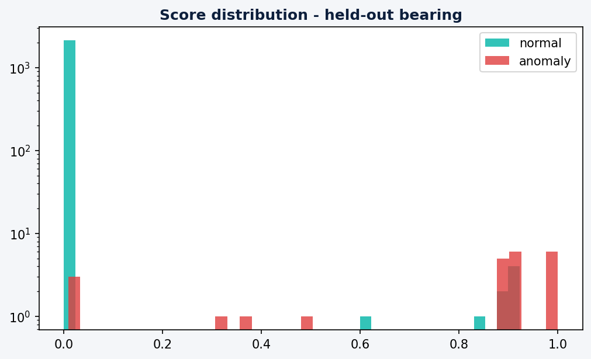
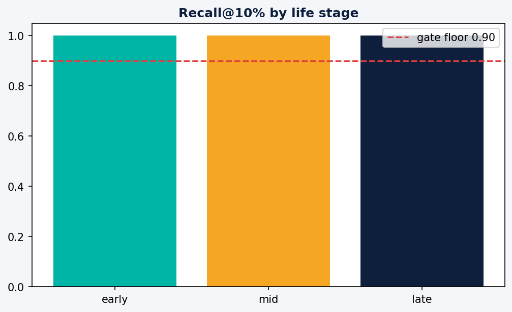

# P9 Evaluation Report

**Model:** `bearing-anomaly-model` v3 · **Registry versions:** [1, 2, 3]

**Overall recall@10% (held-out bearing):** 1.000 (gate floor 0.90)

## Slice evaluation - life stages

| stage   |   rows |   anomalies |   recall_at_10pct |
|:--------|-------:|------------:|------------------:|
| early   |    719 |           2 |                 1 |
| mid     |    718 |           3 |                 1 |
| late    |    719 |          18 |                 1 |

## Figures

*Same metric code path as the CI gate (`src/models/evaluate.py`). Caveat: label-feature affinity (3-sigma labels vs deviation features) documented in the model card.*
